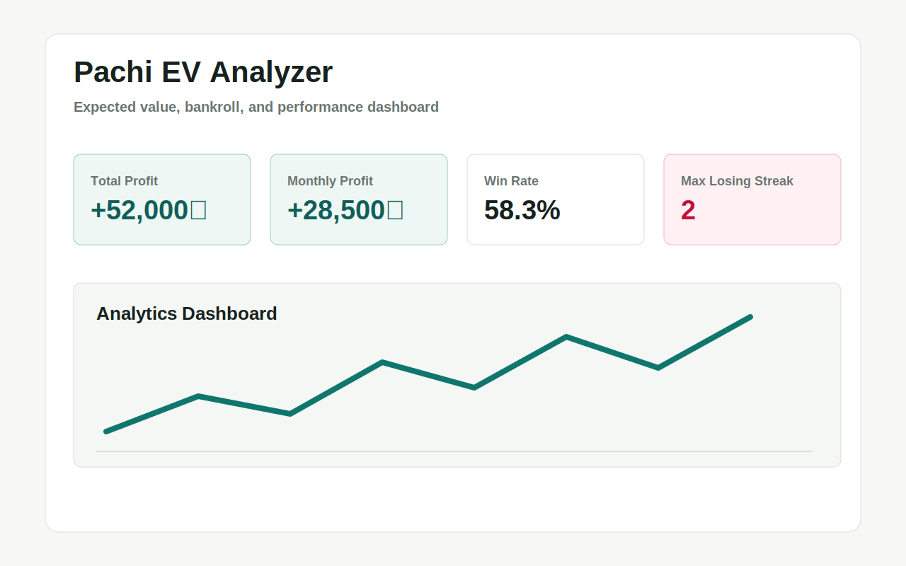
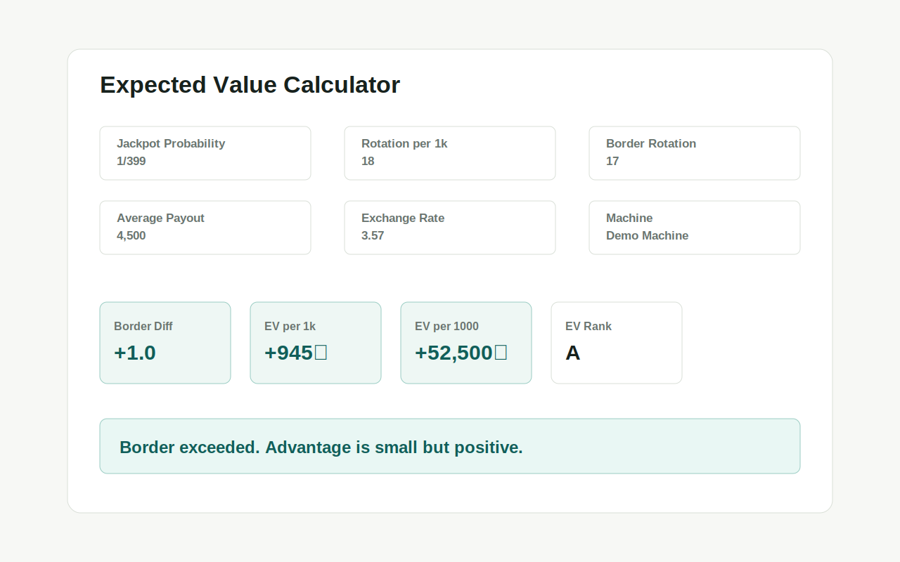
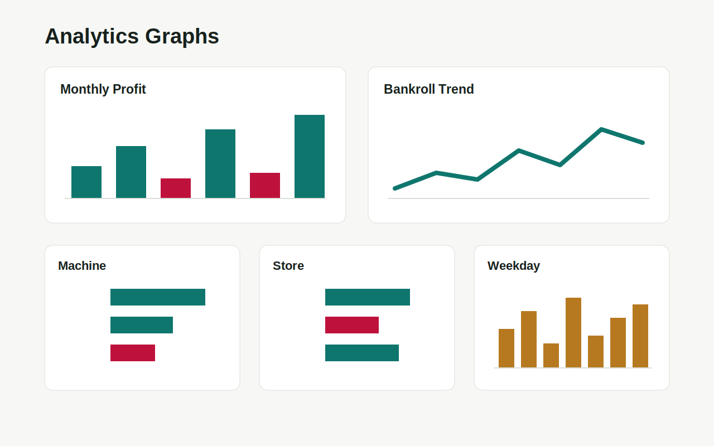
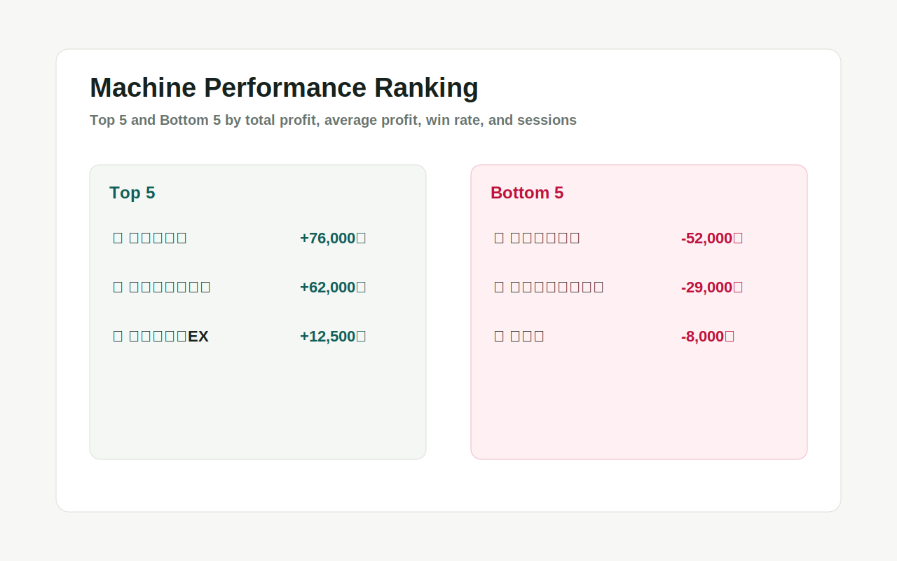
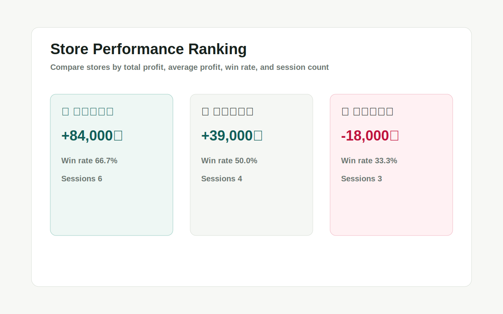
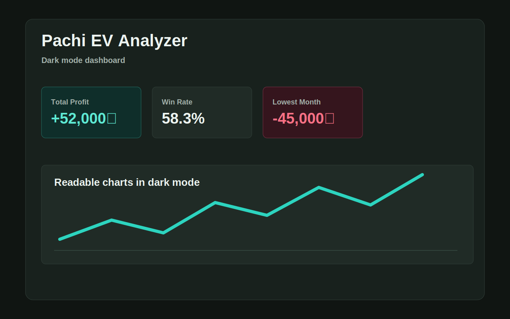
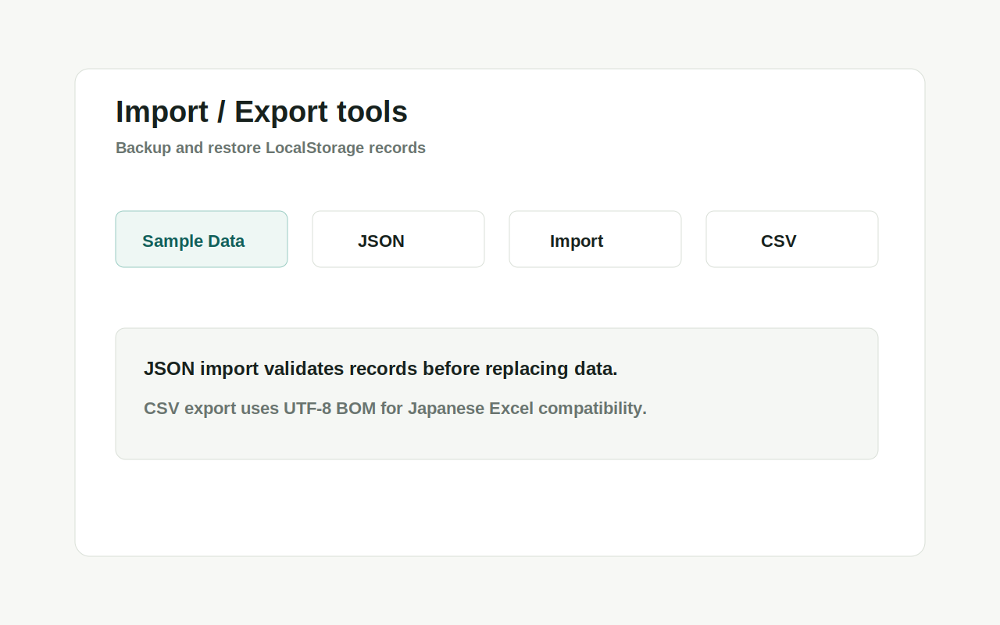

# Pachi EV Analyzer

[](https://nextjs.org/)
[](https://www.typescriptlang.org/)
[](#license)

⭐ If you find this project useful, please consider starring the repository.

Pachi EV Analyzer is an open-source analytics tool for expected value calculation, bankroll management, and performance tracking for pachinko and pachislot players.

The project focuses on statistics, risk management, and data visualization rather than gambling promotion.

## Project Status

Version: 0.2.0

This project is actively maintained as a personal open-source analytics tool.

## Live Demo

Demo URL:

https://pachi-ev-analyzer.vercel.app

## Screenshots

The app includes dashboard KPIs, expected value calculation, bankroll tracking, ranking analytics, import/export tools, analytics charts, and dark mode.

| Dashboard overview | Expected value calculator | Analytics charts |
| --- | --- | --- |
|  |  |  |

| Machine ranking | Store ranking | Dark mode |
| --- | --- | --- |
|  |  |  |

| Import / Export tools |
| --- |
|  |

## Features

- Expected Value Calculator
- Bankroll Management
- Dashboard Analytics
- Monthly Profit Analysis
- Machine Performance Analysis
- Store Performance Analysis
- Weekday Analysis
- Machine Performance Ranking
- Store Performance Ranking
- Risk Monitoring
- JSON Backup Export
- JSON Import
- CSV Export
- PWA Support
- Dark Mode Support
- Sample Data Loader
- LocalStorage-based privacy-first storage

## Why This Project Exists

Many pachinko and pachislot players track results manually, often in notes or spreadsheets.

Existing tools are often spreadsheet-based or focused only on raw calculations.

Pachi EV Analyzer provides expected-value analysis, bankroll tracking, ranking analytics, and performance visualization in a modern web application.

## Disclaimer

This project does not encourage gambling.

Its purpose is to help users understand expected value, statistical variance, bankroll risk, and historical performance through data analysis.

## Tech Stack

- Next.js
- TypeScript
- Tailwind CSS
- Recharts
- LocalStorage

## Getting Started

```bash
npm install
npm run dev
```

Open http://localhost:3000 in your browser.

## Data Storage

The MVP stores data in LocalStorage.

```text
pachi-ev-analyzer-records-v1
pachi-ev-analyzer-settings-v1
```

Use the JSON export button before clearing browser data or moving to another device.

## Privacy

This app stores data only in your browser using LocalStorage.

No server-side database is used in the current version.

## Screenshot Workflow

The app includes a `サンプルデータ読み込み` button for README and release screenshots.

1. Run the local app.
2. Click `サンプルデータ読み込み`.
3. Capture the dashboard, expected value calculator, and analytics graph sections.
4. Save the images in `docs/screenshots/`.
5. Replace the existing screenshot files while keeping these names:
   - `dashboard.svg`
   - `expected-value.svg`
   - `analytics.svg`

PNG files can also be used. If you switch to PNG, update the image paths in this README.

## Roadmap

### Completed

- PWA Support
- Dark Mode
- CSV Export
- JSON Import
- Performance Ranking System

### Planned

- Advanced Analytics
- Historical Trend Analysis
- Risk Simulation
- Session Insights
- Additional Import / Export Options

## Release Notes

### v0.2.0

- Added PWA support with installability metadata, app icons, and a service worker.
- Added light/dark theme support with LocalStorage persistence.
- Added CSV export for profit/loss records.
- Added JSON import for restoring backed-up records.
- Improved dashboard analytics for monthly, machine, store, and weekday performance.
- Improved bankroll management and risk visibility.

## Contributing

Issues and suggestions are welcome.

This project is still in early development, so feedback on usability, analytics, and documentation is appreciated.

## License

MIT License
